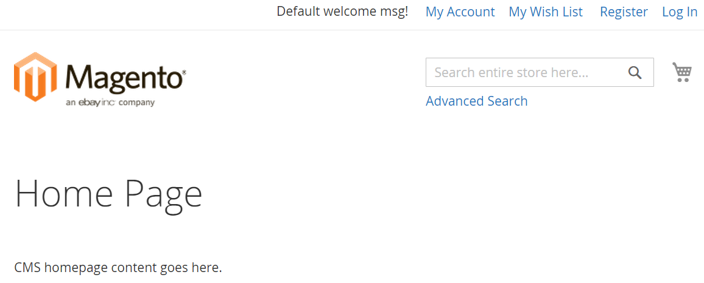
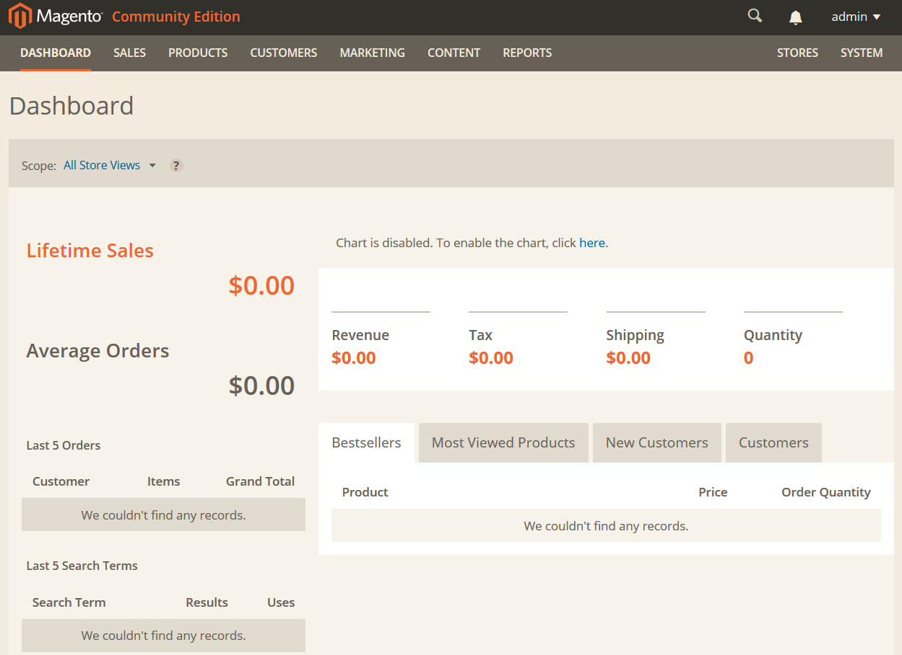

Welcome to Magento 2 installation! We're glad you chose to install Magento 2, a cutting edge, feature-rich eCommerce solution that gets results.

#### Contents 

*	<a href="#magento-2-system-requirements">Magento 2 system requirements</a>
*	<a href="#composer-and-magento">Composer and Magento</a>
*	<a href="#high-level-installation-roadmap">High-level installation roadmap</a>
*	<a href="#required-server-permissions">Required server permissions</a>
*	<a href="#prerequisites">Prerequisites</a>
*	<a href="#installing-composer">Installing Composer</a>
*	<a href="#cloning-the-magento-2-github-repository">Cloning the Magento 2 GitHub repository</a>
*	<a href="#installing-or-reinstalling-the-magento-2-software">Installing or reinstalling the Magento software</a>
*	<a href="#verifying-the-installation">Verifying the installation</a>
*	<a href="#troubleshooting">Troubleshooting</a>

<h2>Magento 2 system requirements</h2>

Before you install Magento 2, make sure your system meets or exceeds the following requirements:

*	Operating systems

	Linux distributions such as RedHat Enterprise Linux (RHEL), CentOS, Ubuntu, Debian, and so on
	
*	<a href="https://getcomposer.org/download/" >Composer</a> (latest stable version)
*	<a href="http://httpd.apache.org/download.cgi" >Apache 2.2</a> or later
*	PHP 5.4.11 or 5.5.x (<a href="http://php.net/downloads.php" >installation</a> instructions, <a href="http://phpave.com/upgrade-php-5-3-php-5-5-ubuntu-12-04-lts/" >upgrade</a> instructions)
*	Required PHP extensions:

	*	PDO/MySQL
	*	mbstring
	*	mcrypt
	*	mhash
	*	simplexml
	*	curl
	*	gd2, ImageMagick 6.3.7 (or later) or both
	*	soap
	
*	<a href="http://dev.mysql.com/doc/refman/5.5/en/installing.html" >MySQL 5.5</a> or later
*	Mail Transfer Agent (MTA) or an SMTP server
*	Optional but recommended: 

	*	<a href="http://xdebug.org/download.php" >php_xdebug2.2.0</a> or later (development environments only; can have an adverse effect on performance)
    *	PHPUnit (as a command-line tool) 3.7 or later 
	

<h2 id="instgde-overview-composer">Composer and Magento</h2>

We now use <a href="https://getcomposer.org/" >Composer</a> to install the Magento 2 software. Composer enables us to manage Magento 2, extensions, and their dependencies.

Composer provides you with the following advantages:

*	Enables you to reuse third-party libraries without bundling them with source code
*	Component-based architecture with robust dependency management
*	Manages dependencies to reduce extension conflicts and compatibility issues
*	Versioned dependencies
*	<a href="https://getcomposer.org/doc/01-basic-usage.md#package-versions" >Semantic versioning</a>
*	Supports PHP Framework Interoperability standards

We'll have more information soon on how developers can use Composer to package extensions to distribute to Magento merchants and to other developers.

<h2 id="instgde-overview-roadmap">High-level installation roadmap</h2>

Following is a brief overview of how to install the Magento 2 software.

<h3>Step 1: Verify your prerequisites</h3>

Use the following table to verify you have the correct prerequisites to install the Magento 2 software.

<table>
	<tbody>
		<tr>
			<th>Prerequisite</th>
			<th>How to check</th>
			<th>For more information</th>
		</tr>
	<tr>
		<td>Apache 2.2 or later</td>
		<td>Ubuntu: <code>apache -v</code> 
		CentOS: <code>httpd -v</code></td>
		<td><a href="#apache" >Apache</a></td>
	</tr>
	<tr>
		<td>PHP 5.4.11 or 5.5.x</td>
		<td><code>php -v</code></td>
		<td><a href="#php" >PHP</a></td>
	</tr>
	<tr><td>MySQL 5.5 or later</td>
	<td><code>mysql -u [root user name] -p</code></td>
	<td><a href="#mysql" >MySQL</a></td>
	</tr>
</tbody>
</table>

<h3>Step 2: Prepare to install</h3>

After verifying your prerequisites, perform the following tasks in order to prepare to install the Magento 2 software.

1.	<a href="#installing-composer">Installing Composer</a>
2.	<a href="#cloning-the-magento-2-github-repository">Cloning the Magento 2 GitHub repository</a>
	
<h3>Step 3: Install and verify</h3>

1.	<a href="#installing-or-reinstalling-the-magento-2-software">Installing or reinstalling the Magento software</a>
2.	<a href="#verifying-the-installation">Verifying the installation</a>

<h2>Required server permissions</h2>

Unless otherwise noted, all commands in this Readme must be entered as a user with `root` privileges and permission to write to the web server docroot. Depending on your system, that might mean you must use different user accounts or add users to the web server user group&mdash;provided that group has sufficient privileges.

Installing software on Linux typically requires `root` privileges. You should generally not install the Magento 2 software in the web server docroot using `root` privileges; however, that is up to you.

<h2 id="readme-prereq">Prerequisites</h2>

This section discusses how to install software required to install Magento 2.

See one of the following sections:

*	<a href="#before-you-begin">Before you begin</a>
*	<a href="#apache">Apache</a>
*	<a href="#php">PHP</a>
*	<a href="#mysql">MySQL</a>

<h3 id="instgde-prereq-overview">Before you begin</h3>

Before you install Magento, you must do all of the following:

*	Set up one or more hosts that meet the <a href="#magento-2-system-requirements">Magento 2 system requirements</a>.
*	Make sure you can back up your entire system at various points during the installation so you can roll back in the event of issues.

<h3>Apache</h3>

<h4>Installing Apache on Ubuntu</h4>

<ol><li>Install Apache using the guidelines on the <a href="https://help.ubuntu.com/10.04/serverguide/httpd.html" target="_blank">Ubuntu site</a>. </li>
<li>Enable server rewrites:
<ul><li>Apache 2.2: Use the guidelines on <a href="http://askubuntu.com/questions/48362/how-to-enable-mod-rewrite-in-apache" target="_blank">askubuntu</a>.</li>
<li>Apache 2.4: Enter the following command: <code>a2enmod rewrite</code></li></ul>
</li>
<li>Specify the type of directives that can be used in <code>.htaccess</code>. Magento uses <code>.htaccess</code> for redirects. For guidelines, see:
<ul><li>Apache 2.2: The <a href="http://httpd.apache.org/docs/2.2/mod/core.html#allowoverride" target="_blank">Apache 2.2 documentation</a>.</li>
<li>Apache 2.4: The <a href="http://httpd.apache.org/docs/current/mod/mod_rewrite.html" target="_blank">Apache 2.4 documentation</a>. 
Note that in Apache 2.4, the server's default site configuration file is <code>/etc/apache2/sites-available/000-default.conf</code> 
For example, you can add the following to the bottom of <code>000-default.conf</code>: 
<pre>&lt;Directory "/var/www">
AllowOverride [value from Apache site]
&lt;/Directory></pre>
<strong>Note</strong>: You must change the value of <code>AllowOverride</code> in the directive for the directory to which you expect to install the Magento software. For example, to install in the web server docroot, edit the directive in <code>&lt;Directory /var/www></code>.</li></ul>
</li>
<li>Restart Apache: <code>service apache2 restart</code></li></ol>

<h4>Installing Apache on CentOS</h4>

1.	Install Apache:

	`yum -y install httpd`
	
	For additional information, see the <a href="http://httpd.apache.org/docs/2.4/platform/rpm.html" target="_blank">Apache site</a>. 
	
2.	Enable <a href="http://unix.stackexchange.com/questions/57946/enable-apache-mod-rewrites-to-load-clean-urls" target="_blank">server rewrites</a>.

	**Note**: You must change the value of <code>Allow Override</code> in the directive for the directory to which you expect to install the Magento software. For example, to install in the web server docroot, edit the directive in <code>&lt;Directory "/var/www/html"></code>.
	
2.	Set the type of directives that can be used in `.htaccess`. Magento uses `.htaccess` for redirects. <a href="http://httpd.apache.org/docs/2.2/mod/core.html#allowoverride" target="_blank">Apache documentation</a>.

3.	Restart Apache: `service httpd restart`

<h3>MySQL</h3>

<h4>Installing MySQL on Ubuntu</h4>

1.	Use the guidelines on the <a href="https://help.ubuntu.com/12.04/serverguide/mysql.html" target="_blank">Ubuntu site</a>. 
2.	Configure the database instance.

<h4>Installing and configuring MySQL on CentOS</h4>

1.	Install and configure MySQL as discussed on the <a href="http://centoshelp.org/servers/database/installing-configuring-mysql-server/" target="_blank">CentOS help site</a>.
2.	Configure the database instance as discussed in the next section.

<h4>Configuring the Magento database instance</h4>

This section discusses how to create a new database instance for Magento. Although a new database instance is recommended, you can optionally install Magento into an existing database instance.

To configure a MySQL database instance:

1.	Log in to your database server as any user.
2.	Enter the following command to get to a MySQL command prompt:
	
	`mysql -u root -p`

3.	Enter the MySQL `root` user's password when prompted.
4.	Enter the following commands in the order shown to create a database instance named `magento` with user name `magento`:
	<pre>create database magento;
CREATE USER 'magento'@'localhost' IDENTIFIED BY 'magento';
GRANT USAGE ON *.* TO magento@localhost IDENTIFIED BY 'magento';
GRANT ALL ON magento.* TO magento@localhost;</pre>

5.	Enter `exit` to quit the command prompt.

<h3>PHP</h3>

Magento 2 requires PHP 5.4.11 or later or PHP 5.5.x.

**Note**: Magento 2 does not support PHP 5.6.

<h3>PHP on Ubuntu</h3>

<h4>Install PHP 5.5 on Ubuntu 14</h4>

To install PHP 5.5 on Ubuntu 14:

1.	Enter the following command:

	`apt-get -y install php5`
	
2.	Verify the PHP version by entering `php -v`. Messages similar to the following should display:

	<pre>PHP 5.5.9-1ubuntu4.4 (cli) (built: Sep  4 2014 06:56:34)
	Copyright (c) 1997-2014 The PHP Group
	Zend Engine v2.5.0, Copyright (c) 1998-2014 Zend Technologies
    with Zend OPcache v7.0.3, Copyright (c) 1999-2014, by Zend Technologies</pre>
	
<h4>Install PHP 5.4 on Ubuntu 12</h4>

To install PHP 5.4 on Ubuntu 12:

1.	Use the following instructions from <a href="http://askubuntu.com/questions/109404/how-do-i-install-latest-php-in-supported-ubuntu-versions-like-5-4-x-in-ubuntu-1" target="_blank">askubuntu</a>:

	<pre>add-apt-repository ppa:ondrej/php5-oldstable
	apt-get update
	apt-get upgrade
	apt-get install php5</pre>

2.	Verify the PHP version by entering `php -v`. Messages similar to the following should display:

	<pre>PHP 5.4.33-2+deb.sury.org~precise+1 (cli) (built: Sep 25 2014 09:06:25)
	Copyright (c) 1997-2014 The PHP Group
	Zend Engine v2.4.0, Copyright (c) 1998-2014 Zend Technologies</pre>

3.	Restart Apache: `service apache2 restart`

<h4>Upgrade to PHP 5.4 on Ubuntu</h4>

To upgrade to PHP 5.4 on Ubuntu:

1.	Use the instructions on <a href="http://phpave.com/upgrade-php-5-3-php-5-5-ubuntu-12-04-lts/" target="_blank">phpave</a>.
2.	After upgrading, verify the PHP version by entering `php -v`. Messages similar to the following should display:

	<pre>PHP 5.4.33-2+deb.sury.org~precise+1 (cli) (built: Sep 25 2014 09:06:25)
	Copyright (c) 1997-2014 The PHP Group
	Zend Engine v2.4.0, Copyright (c) 1998-2014 Zend Technologies</pre>

3.	Restart Apache: `service apache2 restart`

<h4>Install required PHP extensions on Ubuntu</h4>

Enter the following command to install required PHP extensions:

<pre>apt-get -y install php5 php5-mhash php5-mcrypt php5-curl php5-cli php5-mysql php5-gd</pre>

<h4>Ubuntu 14 only: workaround for mcrypt issue</h4>

There is a <a href="https://bugs.launchpad.net/ubuntu/+source/php-mcrypt/+bug/1240590" target="_blank">known issue</a> in Ubuntu 14 with the `mcrypt` PHP extension. To work around the issue, see <a href="http://askubuntu.com/questions/450825/ubuntu-14-04-phpmyadmin-cant-find-mcrypt-extension" target="_blank">askubuntu</a>.

<h4>Upgrade to PHP 5.4 on CentOS</h4>

PHP 5.3 is the default PHP version on CentOS distributions. Upgrade to PHP 5.4 using a repository like <a href="http://blog.famillecollet.com/pages/Config-en" target="_blank">remi</a>. 

The following resources are also available:

*	<a href="http://kb.parallels.com/en/115875" target="_blank">kb.parallels</a>
*	<a href="http://stackoverflow.com/questions/21502656/upgrading-php-on-centos-6-5-final" target="_blank">stackoverflow</a>
*	<a href="http://rpms.famillecollet.com/" target="_blank">remi repository</a>

To upgrade to PHP 5.4:

1.	Enter the following commands:

	<pre>cd /tmp
	rpm -Uvh http://download.fedoraproject.org/pub/epel/6/i386/epel-release-6-8.noarch.rpm
	rpm -Uvh http://rpms.famillecollet.com/enterprise/remi-release-6.rpm
	yum -y --enablerepo=remi install httpd php php-common</pre>

2.	To verify PHP 5.4 is installed, enter `php -v`. The command displays results similar to the following:

	<pre>PHP 5.4.33 (cli) (built: Sep 20 2014 16:20:03)
	Copyright (c) 1997-2014 The PHP Group
	Zend Engine v2.4.0, Copyright (c) 1998-2014 Zend Technologies</pre>

3.	Restart Apache: `service httpd restart`

<h4>Install required PHP extensions on CentOS</h4>

Enter the following command to install required PHP extensions:

`yum -y --enablerepo=remi install php-xml php-mcrypt.x86_64 gd gd-devel php-gd php-mysql`

<h4>Setting the PHP timezone (all operating systems)</h4>

Before you install Magento, you might need to set the system time zone for PHP; otherwise, errors like the following display during the installation and time-related operations like cron might not work:

`PHP Warning:  date(): It is not safe to rely on the system's timezone settings.` [more messages follow]

To set your time zone:

1.	Locate your server's time zone in the available <a href="http://php.net/manual/en/timezones.php" target="_blank">time zone settings</a>.
2.	Locate `php.ini` by entering the following command:

	`php -i | grep "Loaded Configuration File"`
	
	Typical locations follow:
	
	Ubuntu: `/etc/php5/cli/php.ini`
	
	CentOS: `/etc/php.ini`
	
3.	Open `php.ini` in a text editor.

4.	Locate the following setting and uncomment it if necessary:

	`date.timezone =`
	
5.	Add the time zone setting you found in step 1.
6.	Save your changes to `php.ini` and exit the text editor.

<h4>Setting the PHP memory limit (all operating systems)</h4>

Increase `memory_limit` in `php.ini` to at least 512MB for normal operation or 2GB for testing:

1.	Open one of the following in a text editor:

	*	Ubuntu: `/etc/php5/apache2/php.ini`
	*	CentOS: `/etc/php.ini`
2.	Change `memory_limit` to:

	`memory_limit = 512M` or more for normal operation
	
	`memory_limit = 2G` or more for testing
	
3.	Save your changes and exit the text editor. 

4.	Restart Apache:

	Ubuntu: `service apache2 restart`
	
	CentOS: `service httpd restart`

<h2 id="installing-composer">Installing Composer</h2>

To install Composer:

1.	Change to or create an empty directory on your Magento server.

2.	Enter the following commands:

	<pre>curl -sS https://getcomposer.org/installer | php
	mv composer.phar /usr/local/bin/composer</pre>
	
	For additional installation options, see the <a href="https://getcomposer.org/download/" target="_blank">Composer installation documentation</a>.
	
<h2 id="instgde-prereq-compose-clone">Cloning the Magento 2 GitHub repository</h2>

To clone the Magento 2 GitHub repository:

1.	Change to your web server's docroot directory.

	Typically, for Ubuntu, it's `/var/www` and for CentOS it's `/var/www/html`.

2.	Enter any of the following commands as a user with privileges to write to the web server docroot:

	To clone using HTTPS, use either of the following:

	`git clone https://github.com/magento/magento2.git`
	
	`git clone https://[your github.com user name]:[password]@github.com/magento/magento2.git`
	
	To clone using SSH: `git clone git@github.com:magento/magento2.git`
	
3.	Wait for the repository to clone on your server.

**Note**: If you get an error that includes `Permission denied (publickey)`, see <a href="#troubleshooting">Troubleshooting</a>.

<h2>Installing or reinstalling the Magento 2 software</h2>

Before you begin, make sure that:

1.	Your system meets the requirements discussed in <a href="#magento-2-system-requirements">Magento 2 system requirements</a>.
2.	You completed all prerequisite tasks discussed in <a href="#prerequisites">Prerequisites.</a>
3.	You <a href="#installing-composer">installed Composer</a>.
4.	You <a href="#cloning-the-magento-2-github-repository">cloned the Magento 2 GitHub repository</a>.

<h3>Setting file system permissions and ownership before you install</h3>

To make sure the installation completes successfully, we suggest the following file system permissions and ownership:

*	All files and directories owned by the web server user
*	Certain directories must be writable

<h4>Finding the web server user</h4>

To find the web server user, enter one of the following commands:

*	Ubuntu: `ps -ef | grep apache2`
*	CentOS: `grep User /etc/httpd/conf/httpd.conf`

<h4>Pre-installation permissions and ownership</h4>

Before the installation, set the following permissions:

*	All directories have 700 permissions `(drwx------)`.

	700 permissions give full control (that is, read/write/execute) to the owner and no permissions to anyone else.
	
*	All files have 600 permissions `(-rw-------)`.

	600 permissions mean the owner can read and write but other users have no permissions.
	
<h4>Setting permissions and ownership</h4>

1.	To set ownership, enter the following commands as a user with `root` privileges:

	<pre>cd [your Magento installation directory]
	chown -R [web server user name] .</pre>
	
	CentOS example:
	
	<pre>cd /var/www/html/magento2
	chown -R apache .</pre>
	
	Ubuntu example:
	
	<pre>cd /var/www/magento2
	chown -R www-data .</pre>
	
2.	Set file and directory permissions:

	<pre>find . -type d -exec chmod 700 {} \;
	find . -type f -exec chmod 600 {} \;</pre>

<h3>Getting started with your installation</h3>

After you complete the tasks discussed in the preceding section, update Composer and run the installer:

1.	Log in to your Magento server as a user with `root` privileges.
2.	Change to the Magento 2 installation directory. For example,

	`cd /var/www/html/magento2`
	
	**Note**: On Ubuntu, you might have to use the `sudo -s` or equivalent command to access this directory.
	
3.	As user with privileges to write to the web server docroot, enter `composer install`

	This command updates package dependencies and can take a few minutes to complete.
	
4.	Change to the Magento 2 `setup` subdirectory and enter `composer install`.

**Note**: You must run `composer install` from *both* directories.
	
<h3>Running the Magento 2 installer</h3>

This section discusses how to run the command-line installer for Magento 2. 

**Note**: You must install Magento from its `setup` subdirectory.

The installer is designed to be run multiple times if necessary so you can:

*	Provide different values 

	For example, after you configure your web server for Secure Sockets Layer (SSL), you can run the installer to set SSL options.
*	Correct mistakes in previous installations
*	Install Magento in a different database instance

**Note**: By default, the installer doesn't overwrite the Magento database if you install the Magento software in the same database instance. You can use the optional <tt>clean_database</tt> parameter to change this behavior.

**Note**: If you get errors during the installation, see <a href="#troubleshooting">Troubleshooting</a>.

Before you begin, you can run the following commands to find values for some required options:

<table>
	<tbody>
		<tr>
			<th>Installer option</th>
			<th>Command</th>
		</tr>
	<tr>
		<td>Language</td>
		<td><code>php -f index.php help languages</code></td>
	</tr>
	<tr>
		<td>Time zone</td>
		<td><code>php -f index.php help timezones</code></td>
	</tr>
	<tr>
		<td>Currency</td>
		<td><code>php -f index.php help currencies</code></td>
	</tr>
	</tbody>
	</table>
	
	
The format of the command follows:

	<code>php -f index.php install [--[installation option name]=[installation option value] ...</code>

	
The following table discusses the meanings of installation option names and values. An example is provided in <a href="#sample-localhost-installation">Sample localhost installation</a>.

<table>
	<tbody>
		<tr>
			<th>Name</th>
			<th>Value</th>
			<th>Required?</th>
		</tr>
		<tr>
		<td>base_url</td>
		<td>
Base URL to use to access your Magento Admin and storefront in the format <tt>http[s]://[host or ip]/[your Magento base dir]/</tt>.

		
<strong>Note</strong>: The scheme (<code>http://</code> or <code>https://</code>) and a trailing slash are <em>both</em> required.

		
<tt>[your Magento base dir]</tt> is the docroot-relative path in which to install the Magento 2 software. Depending on how you set up your web server and virtual hosts, the path might be <tt>magento2</tt> or it might be blank.

		
To access Magento on localhost, you can use either <code>http://localhost/[your Magento base dir]/</code> or <code>http://127.0.0.1/[your Magento base dir]/</code>.

		</td>
		<td>Yes</td>
	</tr>
	<tr>
		<td>backend_frontname</td>
		<td>Path to access the Magento Admin. This path is appended to Base URL.
For example, if Base URL is http://www.example.com and Admin Path is <code>admin</code>, the Admin Panel's URL is <code>http://www.example.com/admin</code>&mdash;provided you configured your web server for server rewrites.</td>
		<td>Yes</td>
	</tr>
	<tr>
	<tr>
		<td>db_host</td>
		<td>
Use any of the following:

		<ul><li>The database server's fully qualified host name or IP address.</li>
		<li><code>localhost</code> if your database serve is on the same host as your web server.</li>
		<li>UNIX socket; for example, <code>/var/run/mysqld/mysqld.sock</code></li></ul>
		
<strong>Note</strong>: You can optionally specify the database server port in its host name like <code>www.example.com:9000</code>

</td>
		<td>Yes</td>
	</tr>
	<tr>
		<td>db_name</td>
		<td>Name of the Magento database instance in which you want to install the Magento database tables.</td>
		<td>Yes</td>
	</tr>
	<tr>
		<td>db_user</td>
		<td>User name of the Magento database instance owner.</td>
		<td>Yes</td>
	</tr>
	<tr>
		<td>db_pass</td>
		<td>Magento database instance owner's password.</td>
		<td>No</td>
	</tr>
	<tr>
		<td>db_prefix</td>
		<td>
Use only if you're installing the Magento database tables in a database instance that has Magento tables in it already.

		
In that case, use a prefix to identify the Magento tables for this installation. Some customers have more than one Magento instance running on a server with all tables in the same database.

		
This option enables those customers to share the database server with more than one Magento installation.
</td>
		<td>No</td>
	</tr>

		<td>admin_firstname</td>
		<td>Magento administrator user's first name.</td>
		<td>Yes</td>
	</tr>
	<tr>
		<td>admin_lastname</td>
		<td>Magento administrator user's last name.</td>
		<td>Yes</td>
	</tr>
	<tr>
		<td>admin_email</td>
		<td>Magento administrator user's e-mail address.</td>
		<td>Yes</td>
	</tr>
	<tr>
		<td>admin_username</td>
		<td>Magento administrator user name.</td>
		<td>Yes</td>
	</tr>
	<tr>
		<td>admin_password</td>
		<td>Magento administrator user password.</td>
		<td>Yes</td>
	</tr>
	<tr>
		<td>language</td>
		<td>Language code to use in the Admin and storefront. (If you have not done so already, you can view the list of language codes by entering <code>php -f index.php help languages</code> from the <code>setup</code> directory.)</td>
		<td>Yes</td>
	</tr>
	<tr>
		<td>currency</td>
		<td>Default currency to use in the storefront. (If you have not done so already, you can view the list of currencies by entering <code>php -f index.php help currencies</code> from the <code>setup</code> directory.)</td>
		<td>Yes</td>
	</tr>
	<tr>
		<td>timezone</td>
		<td>Default time zone to use in the Admin and storefront. (If you have not done so already, you can view the list of time zones by entering <code>php -f index.php help timezones</code> from the <code>setup</code> directory.)</td>
		<td>Yes</td>
	</tr>
	<tr>
		<td>use_secure</td>
		<td>
<code>1</code> enables the use of Secure Sockets Layer (SSL) in all URLs (both Admin and storefront). Make sure your web server supports SSL before you select this option.

		
<code>0</code> disables the use of SSL with Magento. In this case, all other secure URL options are assumed to also be <code>0</code>.
</td>
		<td>No</td>
	</tr>
	<tr>
		<td>base_secure_url</td>
		<td>
<code>1</code> means SSL is preferred in Magento URLs designed to use it (for example, the checkout page). Make sure your web server supports SSL before you select this option.

		
<code>0</code> means SSL is not used.
</td>
		<td>No</td>
	</tr>
	
	<tr>
		<td>use_secure_admin</td>
		<td>
<code>1</code> means you use SSL to access the Magento Admin. Make sure your web server supports SSL before you select this option.

		
<code>0</code> means you do not use SSL with the Admin.
</td>
		<td>No</td>
	</tr>
	<tr>
		<td>admin_use_security_key</td>
		<td>
<code>1</code> causes the Magento software to use a randomly generated key value to access pages in the Magento Admin and in forms. These key values help prevent <a href="https://www.owasp.org/index.php/Cross-Site_Request_Forgery_%28CSRF%29" target="_blank">cross-site script forgery attacks</a>.

		
<code>0</code> disables the use of the key.
</td>
		<td>No</td>
	</tr>
	<tr>
		<td>session_save</td>
		<td>
Use any of the following:

		<ul><li><code>files</code> to store session data in the file system. File-based session storage is appropriate unless the Magento file system access is slow or you have a clustered database.</li>
		<li><code>db.files</code> to store session data in the database. Choose database storage if you have a clustered database; otherwise, there might not be much benefit over file-based storage.</li></ul></td>
		<td>No</td>
	</tr>
	<tr>
		<td>key</td>
		<td>If you have one, specify a key to encrypt sensitive data in the Magento database. (This includes passwords and personally identifiable customer information.) If you don't have one, Magento generates one for you.</td>
		<td>No</td>
	</tr>
	<tr>
		<td>cleanup_database</td>
		<td>To drop database tables before installing the Magento 2 software, specify this parameter without a value. Otherwise, the Magento database is left intact.</td>
		<td>No</td>
	</tr>
	<tr>
		<td>db_init_statements</td>
		<td>Advanced MySQL configuration parameter. Uses database initialization statements to run when connecting to the MySQL database. Consult a reference similar to <a href="http://dev.mysql.com/doc/refman/5.6/en/server-options.html" target="_blank">this one</a> before you set any values.</td>
		<td>No</td>
	</tr>
	<tr>
		<td>sales_order_increment_prefix</td>
		<td>Specify a string value to use as a prefix for sales orders. Typically, this is used to guarantee unique order numbers for payment processors.</td>
		<td>No</td>
	</tr>
	
	</tbody>
</table>

<h4>Sample localhost installation</h4>

The following example installs Magento with the following options:

*	The Magento software is installed in the `magento2` directory relative to the web server docroot on `localhost` and the path to the Magento Admin is `admin`; therefore:

	Your storefront URL is `http://localhost` and you can access the Magento Admin at `http://localhost/admin`
	
*	The database server is on the same host as the web server.

	The database name is `magento`, and the user name and password are both `magento`
	
*	The Magento administrator has the following properties:

	*	First and last name are is `Magento User`
	*	User name is `admin` and the password is `iamtheadmin`
	*	E-mail address is `user@example.com`

*	Default language is `en_US` (U.S. English)
*	Default currency is U.S. dollars
*	Default time zone is U.S. Central (America/Chicago)

<pre>php -f index.php install --base_url=http://localhost/magento2/
	--backend_frontname=admin 
	--db_host=localhost --db_name=magento 
	--db_user=magento --db_pass=magento 
	--admin_firstname=Magento --admin_lastname=User 
	--admin_email=user@example.com 	--admin_username=admin 
	--admin_password=iamtheadmin --language=en_US
	--currency=USD --timezone=America/Chicago</pre>

<h3 id="instgde-install-magento-reinstall">Reinstalling the Magento 2 software</h3>

This section discusses how to install the Magento 2 software after you installed it previously. You might do this in an development environment especially to get all the latest code changes.

To reinstall the Magento 2 software:

1.	Optionally delete and re-create the database instance.
2.	Log in to your Magento server as a user with permissions to modify files in the Magento file system.
3.	Enter the following commands in the order shown:

	<pre>cd [your Magento install dir]
git pull
composer install
cd setup
composer install</pre>

4.	Repeat the tasks discussed in <a href="#installing-or-reinstalling-the-magento-2-software">Installing or reinstalling the Magento 2 software</a>.

<h2>Verifying the installation</h2>

<h3>Verifying the storefront</h3>

Go to the storefront in a web browser. For example, if your Magento 2 installation base URL is `http://www.example.com`, enter it in your browser's address or location bar.

The following figure shows a sample storefront page. If it displays as follows, your installation was a success!

If the page appears unconfigured (no styles, only text), see <a href="troubleshooting">Troubleshooting</a>.

<h3>Verifying the Magento Admin</h3>

Go to the Magento Admin in a web browser. For example, if your Magento 2 installation base URL is `http://www.example.com`, and the Admin URL is `admin`, enter `http://www.example.com/admin` in your browser's address or location bar.

(The Admin URL is specified by the value of the `backend_frontname` installation parameter.)

When prompted, log in as a Magento Administrator.

The following figure shows a sample Magento Admin page. If it displays as follows, your installation was a success!

If the page appears unconfigured (no styles, only text), see <a href="troubleshooting">Troubleshooting</a>.

If you get a 404 (Not Found) error similar to the following, see <a href="troubleshooting">Troubleshooting</a>:

`The requested URL /magento2index.php/admin/admin/dashboard/index/key/0c81957145a968b697c32a846598dc2e/ was not found on this server.`

<h2>Troubleshooting</h2>

### Problem: Cannot clone the Magento 2 GitHub repository

**Detail**: Error is similar to the following:

<pre>Cloning into 'magento2'...
Permission denied (publickey).
fatal: The remote end hung up unexpectedly</pre>

**Solution**: Upload your SSH key to GitHub as discussed in <a href="https://help.github.com/articles/generating-ssh-keys" target="_blank">the GitHub help page</a>.

### Problem: Cannot run 'composer install'

**Suggestion**: Change to the directory in which you installed Composer and enter the following command:

`mv composer.phar /usr/local/bin/composer`

### Problem: During installation, PHP date warning

**Details**: During the installation, the following message displays: 

`PHP Warning:  date(): It is not safe to rely on the system's timezone settings. [more]`

**Solution**: <a href="#php">Set the PHP timezone properly</a>.

### Problem: During installation, the following fatal error displays:

`PHP Fatal error:  Class 'PDO' not found in /var/www/html/magento2/setup/module/Magento/Setup/src/Module/Setup/ConnectionFactory.php on line 44`

**Solution**: Make sure you installed all required <a href="#php">PHP extensions</a>.

### Problem: You cannot access Magento in a web browser

**Details**: The following message displays when you try to access the Magento storefront or Admin:

<pre>Whoops, it looks like you have an invalid PHP version.
Magento supports PHP 5.4.11 or newer. </pre>

**Solution**: Either <a href="#php">upgrade PHP</a> or restart Apache (Apache might not be using the same PHP version as is on the file system).

To restart Apache:

*	Ubuntu: `service apache2 restart`
*	CentOS: `service httpd restart`

### Problem: Error after logging in to the Magento Admin:

`The requested URL /magento2index.php/admin/admin/dashboard/index/key/0c81957145a968b697c32a846598dc2e/ was not found on this server.`

Note the lack of a slash character between <tt>magento2</tt> and <tt>index.php</tt> in the URL.

**Solution**: The base URL is not correct. The base URL must start with <tt>http://</tt> or <tt>https://</tt> *and* it must end with a slash (/). Run the installation again with a valid value.

### Problem: After installing, images and stylesheets do not load; only text displays, no graphics. 

**Details**: The path to images and stylesheets is not correct, either because of an incorrect base URL or because <a href="#apache">server rewrites</a> are not set up properly. To confirm this is the case, use a web browser inspector to check the paths to static assets and verify those assets are located on the Magento file system.

Magento 2 static assets should be located under `[your Magento install dir]/pub/static/` (there should be `frontend` and `adminhtml` directories).

Verify your server rewrites setting and your base URL and try again.