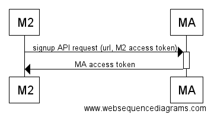
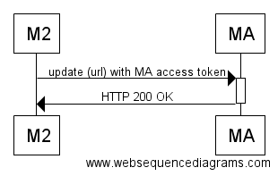
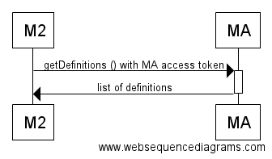
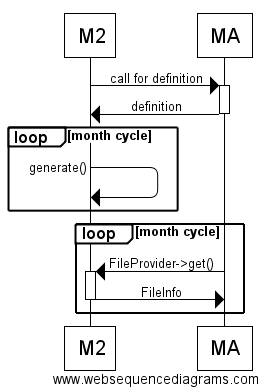
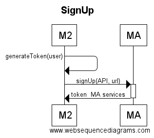
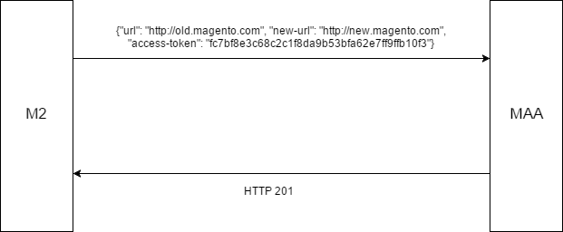

## Glossary

|Term|Meaning|Description|
|--- |--- |--- |
|MBI|Magento Business Intelligence|Software as a service reporting service|
|Advance Reporting||The free MBI service for Magento Community Edition (CE) customers. Users can access the Advanced Reporting page from Magento|
|BI Essentials||The paid MBI service for CE customers. Users can access the BI Essentials page from Magento|
|DD|Data Definition|The file with a list of data to be transferred to the MBI service. After being converted to the report format, the data is shown on the Advanced Reporting page|
|MBIIM|MBI Integration Module|Set of CE modules to enable integration with MBI|
|External Data Definitions||Data definitions which Magento gets dynamically from the MBI service|
|Allowed Data||The data configuration inside Magento with permission to be sent to an external reporting service|
|OTP|One-Time Password|Unique key to get an authorized access to the Advanced Reporting page|

## Overview

The main purpose of this document is to describe the way MBI can be integrated with Magento 2. This document describes the work that needs to be done in the scope of the Free Tier project.

## Integration Module Architecture

### Module Structure

* Analytics

    *   Provide subscription and restore the subscription procedures

    *   Declare the configuration of collected data

    *   Process the data collection

    *   Introduce an API for transferring the collected data to the MBI service

    *   Provide an Access Control List (ACL)

    *   Implement a Configuration page

*   CustomerAnalytics

    *   Configure data definitions for data collection related to the Customer module entities

*   SalesAnalytics:

    *   Configure data definitions for data collection related to the Sales module entities

    

### Data Interchange

#### Subscription
   

#### Subscription Update
   

### Request the External Data Definitions (TBD)
   

### Data Transition
   

## Report XML

### Overview

**Report XML** is a markup language for building the Analytics reports. The language declares SQL queries using the XML declaration. Report XML is easy to process and validate.

Third party developers can retrieve data using a report name. Report name is the same as the `name` attribute in the _&lt;report&gt;_ node, as described below. The `getReport` method of the report provider returns the object that implements the Iterator Interface.

### Creating a new report

Report files must be located in the `etc` folder of your module, like this:

```
<module_name>/etc/reports.xml
```

Report files can be located in any custom module that depends on Analytics (e.g. the `SalesAnalytics` module created for Sales related reports). Each report is declared in the _&lt;report&gt;_ node inside the _&lt;config&gt;_ node. A single report node is rendered into a single SQL query.

The _&lt;config&gt;_ node contains the following attributes:

|Name|Description|Required?|
|--- |--- |--- |
|name|Name of report|True|
|connection|Name of connection to the DB|False|
|iterator|Full class name to a statement iterator|False|

All data of the `reports.xml` file from the _&lt;report&gt;_ node that has the same attribute name will be merged. The Magento store can have more than one DB. Therefore, we should specify a connection name using the `connection` attribute.

You can use a custom iterator to modify or filter data. To use a custom iterator, add an `iterator` attribute that must contain an iterator class or interface name. This iterator can get statement iterator in the constructor method and wrap or change the current values with the custom data.

Below is an example of the `reports.xml` file:

```
<?xml version="1.0"?>
   <!--
   /**
    * Copyright © 2013-2017 Magento, Inc. All rights reserved.
    * See COPYING.txt for license details.
    */
   -->
   <config xmlns:xsi="http://www.w3.org/2001/XMLSchema-instance" xsi:noNamespaceSchemaLocation="urn:magento:module:Magento_Analytics:etc/reports.xsd">
       <report name="modules" connection="default" iterator="Magento\Analytics\Model\ReportXml\ModuleIterator">
           <source name="setup_module">
               <attribute name="module" alias="module_name"/>
               <attribute name="schema_version"/>
               <attribute name="data_version"/>
           </source>
       </report>
       <report name="config_data" connection="default">
           <source name="core_config_data">
               <attribute name="path"/>
               <attribute name="value"/>
           </source>
       </report>
   </config>
```

### Data sources

The data sources (that must correspond to table names in a database) are described inside the _&lt;report&gt;_ node. The main table is specified with the _&lt;source&gt;_ tag. After rendering, it is represented as the `FROM` statement in an SQL query.

The _&lt;source&gt;_ node contains the following attributes:

|Name|Description|Required?|
|--- |--- |--- |
|name|Table name|True|
|alias|Table alias|False|

The name must be the same as the table name in DB. The `alias` attribute can be used in the same way as an alias in the SQL.

In the source node, you can also add a data source with the _&lt;link-source&gt;_ tag. After rendering it is represented as the `JOIN` statement in an SQL query.

The _&lt;link-source&gt;_ node contains the following attributes:

|Name|Description|Required?|
|--- |--- |--- |
|name|Table name|True|
|alias|Table alias|False|
|link-type|Join type|False|

The name must be the same as the table name in DB. The `alias` attribute can be used in the same way as an alias in the SQL. The `link-type` attribute specifies the type of join in SQL query and can be either `INNER` or `LEFT`.

Join conditions are described in the _&lt;link-source&gt;_ node using the _&lt;using&gt;_ tag. After rendering it is represented as the `ON` statement in an SQL query. _&lt;using&gt;_ works in the same way as the filter, described below in this document.

**Example of orders' data source in reports.xml**

```
<report name="orders" connection="sales">
    <source name="sales_order" alias="sales">
        <attribute name="entity_id"/>
        <attribute name="base_grand_total"/>
        <attribute name="base_tax_amount"/>
        <attribute name="base_shipping_amount"/>
        <attribute name="coupon_code"/>
        <attribute name="created_at"/>
        <attribute name="store_id"/>
        <attribute name="email"/>
        <link-source name="sales_order_address" alias="billing" link-type="left">
            <attribute name="email"/>
            <using glue="and">
                <condition attribute="parent_id" operator="eq" type="identifier">entity_id</condition>
                <condition attribute="address_type" operator="eq" type="value">billing</condition>
            </using>
        </link-source>
    </source>
</report>
```

### Report columns

Report XML does not support the asterisk statement. All columns must be declared:

* for the main table — inside the _&lt;source&gt;_ node

* for join tables — inside the _&lt;link-source&gt;_ node

Columns are added using the _&lt;attribute&gt;_ tag.

The _&lt;attribute&gt;_ node contains the following attributes:

|Name|Description|Required?|
|--- |--- |--- |
|name|Column name|True|
|alias|Column alias|False|

The name must be the same as the column name in DB. The `alias` attribute can be used in the same way as the column alias in SQL.
Additional columns can be added using a custom iterator declaration (see the [Creating a new report](#creating-a-new-report) section above).

### Report filters

A report can be filtered using the _&lt;filter&gt; tag_, declared inside the _&lt;source&gt;_ node.

Filters use an attribute glue that helps filter records based on more than one condition. Glue has 2 types:

* __AND__ (default)

* __OR__

A node filter can have nested filters or/and _&lt;conditions&gt;_.

**Example of a nested condition in SQL:**

```
WHERE ((billing.entity_id IS NULL AND ((billing.entity_id < '200' AND billing.entity_id != '42') AND (billing.entity_id > '200' OR billing.entity_id != '201'))))
```

**Example of a nested condition in Report XML:**

```
<filter glue="and">
    <condition attribute="entity_id" operator="null" />
    <filter glue="and">
        <condition attribute="entity_id" operator="lt">200</condition>
        <condition attribute="entity_id" operator="neq">42</condition>
    </filter>
    <filter glue="or">
        <condition attribute="entity_id" operator="gt">200</condition>
        <condition attribute="entity_id" operator="neq">201</condition>
    </filter>
</filter>
```

The _&lt;conditions&gt;_ node contains the following attributes:

|Name|Description|Required?|
|--- |--- |--- |
|attribute|Column name|True|
|type|Type of comaprsion value|False|
|operator|Comparison operator|True|

The attribute must be the same as the column name in DB.

The attribute type can be a value or an identifier. In case the type is an identifier, the value inside a condition is the column. In case type is value, it means it is the scalar value. By default, the type is the value.

An operator describes which comparison operator is used to compare columns with the value or columns that can be specified inside the _&lt;conditions&gt;_ XML node.

All the supported comparison operators can be found in:

```
\Magento\Analytics\ReportXml\DB\ConditionResolver::$conditionMap.
```

## Access Rights

There are two ACL resources introduced for MBIIM purposes:

* 'Analytics\API' - permission to download the data archive
* 'Stores\Settings\Configuration\Analytics' - permission to manage (enable/disable) subscription on the configuration page

### Download the data archive

The MBI service must use the Magento API for downloading the data archive. To do that, a Magento instance creates a special admin user during the installation process. The user has permissions to access the data archive via API only and cannot perform any other actions.

Note: it is strictly not recommended to remove users or edit their ACL.

### Manage the subscription

To be able to manage MBI subscription, an admin user must have the corresponding permissions. For this case, the user can change the subscription status via the popup menu or in the corresponding configuration section.

## Subscription to Advanced Reporting

*   MBIIM installs a new service user and ACL to access the API

*   The automatically created service user cannot access the Magento admin panel directly

*   Service user can perform calls to the API which retrieve the previously collected data

*   Advanced Reporting provides Subscription API

*   The Subscription API receives a Magento 2 connection token

*   The Subscription API returns a token for future access to Magento Analytics services

*   Cron enabled and configured for Magento

#### Precondition

*   MAFT installs new user and ACL to access API

*   Automatically created user can not access to Magento admin panel directly

*   User can perform calls to API which retrieve previously collected data

*   Magento Analytics provides sign-up API

*   The sign-up API receives Magento 2 connection token

*   The sign-up API returns token for future access to Magento Analytics services

*   Cron enabled and configured for Magento

#### Design

*   After the Free Tier module has been installed, the merchant can enable the subscription

*   Magento 2 generates new access token for an API user and sends it to the MBI signup service

*   MBI returns an own access token

*   Received token is stored in Magento System Configuration

*   Subscription is applied to all merchant`s websites and stores

#### SignUp

   

**SignUp payload:**

```
{
   "token": "fc7bf8e3c68c2c1f8da9b53bfa62e7ff9ffb10f3",
   "url": "demo-store.magento.com"
}
```

#### Exception Handling

* If Magento does not receive the MBI access token or the sign-up service returns an error message, Magento repeats the API sign-up call to the MBI service

* The interval for executing the calls SignUp command and the number of attempts is preconfigured in the module code.

### Sign-Up (Confirmation) window

Users can allow sending their system configuration and transaction data to the MBI service using the Sign-Up window.

The confirmation modal window pops up every seven days until the 'OK' button is pressed (regardless of whether the corresponding checkbox is checked or not).

Clicking the 'OK' button calls the `\Magento\Analytics\Model\NotificationTime::unsetLastTimeNotificationValue()` function that deletes the _'notification_time'_ flag from the `flag` DB table.

The confirmation modal window is displayed only if the following conditions are true:

* the flag exists in the DB table

* period after the last notification (time stamp recorded in the `flag_data` attribute) is more than 7 days (in seconds)

The confirmation modal window is added to the content of the following layout:

```
app/code/Magento/Analytics/view/adminhtml/layout/adminhtml_dashboard_index.xml'
```

```
<body>
        <referenceContainer name="content">
            <uiComponent name="analytics_subscription_form" acl="Magento_Analytics::analytics_settings" condition="analytics::can-view-notification" />
        </referenceContainer>
</body>
```

A subscription form is added as the following UI component:

```
'app/code/Magento/Analytics/view/adminhtml/ui_component/analytics_subscription_form.xml'.
```

The form contains two actions that call the corresponding controllers:

* 'OK' action calls \Magento\Analytics\Controller\Adminhtml\Subscription\Activate

* 'Cancel' action calls \Magento\Analytics\Controller\Adminhtml\Subscription\Postpone

The `Activate` controller enables subscription through the `\Magento\Analytics\Model\Subscription` service. The service sets the `default/analytics/subscription/enabled` configuration to "True", this triggers the `\Magento\Analytics\Model\Config\Backend\Enabled\SubscriptionHandler::process()` and sets a cron job (refer to 'app/code/Magento/Analytics/etc/crontab.xml').

The `Postpone` controller registers the time of the most recent notification; this time is used by cron to calculate the time of the next notification.

### Config Management

*   After user confirms the subscription, Magento stores the information about enabling the subscription in the config settings

*   Magento creates cron to call the MBI sign-up service

*   In case of success, cron adds the received authentication token in the config settings

*   In case of failure, cron decrements the numbers of allowed attempts and schedules the next run (with 24 allowed attempts as maximum)

*   User can trigger subscription directly by using the 'Subscribe' button on the config page

The user can unsubscribe from the MBI services. Magento 2 does not perform any additional calls to MBI.

### Sign-Up process sequence

1. Admin enables subscription via the pop-up or in General > Advanced reporting section of the Admin panel. At this point, the `\Magento\Analytics\Model\Config\Backend\Enabled\SubscriptionHandler` controller creates and saves the cron expression.

2. Magento parses the `\Magento\Analytics\etc\crontab.xml` file that contains the following declaration in `cronjob.xml`:

```
<group id="default">
    <job name="analytics_subscribe" instance="Magento\Analytics\Cron\SignUp" method="execute" />
</group>
```

3. The cron for this cron job is built from the database.

4. The `\Magento\Analytics\Cron\SignUp` function runs the `SignUp` command from the commands pool that is contained in the `\Magento\Analytics\Model\Connector` folder.

5. If the `SignUp` command is executed successfully, the `\Magento\Analytics\Cron\SignUp` function stops further executions of the command by removing the cron expression created in step #1.

6. If the `SignUp` command fails, the `\Magento\Analytics\Cron\SignUp` function runs the command once in an hour until:

* it is not executed successfully, or

* the number of retries doesn't reach the number of allowed attempts

The number of allowed attempts is stored in this flag:

```
\Magento\Analytics\Model\Config\Backend\Enabled\SubscriptionHandler::ATTEMPTS_REVERSE_COUNTER_FLAG_CODE.
```

### SignUpCommand responsibilities

*   Generate the ApiUserToken

*   Call the analytics service for signup

*   Log errors


### Sign-Up Retry

* If the subscription status is `failed` (see [Subscription Statuses](#subscription-statuses) below) after the sign-up process, the user receives a notification.

* This notification message contains the text that the subscription process has failed, and a retry link. The link allows to retry getting subscription - start the sign-up process again.

* The notification is displayed permanently on all pages of the Admin panel if the subscription status is `failed`.

## Cancel/restore the subscription

### Overview

Subscription for the MBI service may be canceled (disabled) or restored (enabled) at any time in the Stores > Configuration > General > Advanced reporting section of the Admin panel.

When the configuration value is changed, the `\Magento\Analytics\Model\Config\Backend\Enabled::afterSave()` function uses the `\Magento\Analytics\Model\Config\Backend\Enabled\SubscriptionHandler` service to activate/deactivate the MBI subscription.

Magento receives the MBI token only once during the first successful sign-up request. Later on, the MBI token is not removed if the subscription is canceled (disabled).

Thus, no additional sign-up request is sent when the subscription is restored (enabled) after cancellation. Note: the `\Magento\Analytics\Model\AnalyticsToken` class is responsible for all operations with the MBI token (set/get value, check if the token exists).

### Subscription statuses

Subscription may have several statuses. Magento considers subscription as **'enabled'**, **'pending'**, **'failed'** or **'disabled'** by checking the following configuration parameters:

* **Subscription state**: `default/analytics/subscription/enabled`, boolean, located in the `core_config_data` DB table

* **MBI token**: `analytics/general/token`, string, located in the `core_config_data` DB table

* **Reserve counter of attempts to subscribe**: `analytics_link_attempts_reverse_counter`, integer, located in the `flag` DB table

Thus, subscription is considered as **'enabled'** if:

* 'default/analytics/subscription/enabled' is **1**

* 'analytics/general/token' is **present and not empty**

Subscription is considered as **'pending'** if:

* 'default/analytics/subscription/enabled' is **1**

* 'analytics/general/token' is **absent or empty**

Subscription is considered as **'failed'** if:

* 'default/analytics/subscription/enabled' is **1**

* 'analytics/general/token' is **absent or empty**

* 'analytics_link_attempts_reverse_counter' is **absent**

Subscription is considered as **'disabled'** if:

* 'default/analytics/subscription/enabled' is **0**, regardless of 'analytics/general/token'

See the `\Magento\Analytics\Model\SubscriptionStatusProvider` class that determins the subscription status.

## Update of a subscription for the Advanced Reporting

Since the Advanced Reporting service identifies Magento instances by a combination of a secure base URL and a unique token, the Magento team has implemented a subscription update mechanism to keep synchronization with the Advanced Reporting service in case the secure base URL of a store has been changed.

The mechanism consists of two main elements: the plugin and the cron job.

### The plugin

The plugin detects changes in the secure base URL of a Magento store. If such changes have been detected and a Magento instance is already subscribed for the Advanced Reporting service, the plugin creates a corresponding cron job to schedule the sending of the `Update` request.

**A fragment of the 'app/code/Magento/Analytics/etc/di.xml' file:**
```
<config>
   ...
   <type name="Magento\Config\Model\Config\Backend\Baseurl">
       <plugin name="updateAnalyticsSubscription" type="Magento\Analytics\Model\Plugin\BaseUrlConfigPlugin" />
   </type>
   ...
</config>
```

### The cron job

The cron job performs a corresponding request to notify the Advanced Reporting service that a secure base URL has been changed. The job is executed every hour until the notification is successful.

**A fragment of the 'app/code/Magento/Analytics/etc/crontab.xml' file:**
 ```
 <group id="default">
     ...
     <job name="analytics_update" instance="Magento\Analytics\Cron\Update" method="execute" />
     ...
 </group>
 ```
### The Update Request
  

The `Update` request is a **PUT HTTP request** that contains data in the JSON format. The endpoint for the request is configured in the the `app/code/Magento/Analytics/etc/config.xml` file.

The request is considered successful only if the Advanced Reporting service responds with a **201 HTTP status.**

**An example of an 'Update' request body**

```
{
  "url": "https://old.magento.com",
  "new-url": "https://new.magento.com",
  "access-token": "fc7bf8e3c68c2c1f8da9b53bfa62e7ff9ffb10f3"
}
```
Note: the example above contains a complete list of allowed parameters. All these parameters are required.

## Subscription to BI Essentials

The Integration Module provides the link to open BI Essentials as an external service.

The link is in the **Reports** section of the Main Menu.

## Data collection and transition to MBI

### Configuration of data collection

A Magento instance collects data that the MBI service uses for building advanced reports. To configure data collection, use the new configuration file: `/etc/analytics.xml`.

The file describes the information being collected and how it is distributed among the data sets (files).

**An example of a '/etc/analytics.xml' file**

```
<?xml version="1.0"?>
<!--
/**
 * Copyright © 2013-2017 Magento, Inc. All rights reserved.
 * See COPYING.txt for license details.
 */
-->
<config xmlns:xsi="http://www.w3.org/2001/XMLSchema-instance" xsi:noNamespaceSchemaLocation="urn:magento:module:Magento_Analytics:etc/analytics.xsd">
    <file name="modules">
        <providers>
            <reportProvider name="modules" class="Magento\Analytics\ReportXml\ReportProvider">
                <parameters>
                    <name>modules</name>
                </parameters>
            </reportProvider>
        </providers>
    </file>
</config>
```

The example describes the following:

*   The `modules.csv` data file must be included into the data archive prepared for the MBI service

*   The file must be filled with data provided by the `\Magento\Analytics\ReportXml\ReportProvider` class

*   The class must provide data according to the definition of the `modules` report (see the `/etc/reports.xml` file)

Note: the '\Magento\Analytics\Model\ReportWriter' class is responsible for choosing the data file extension (.csv, .json, and others).

Configuration of data collection may be extended or changed in any module by adding the corresponding `/etc/analytics.xml` file.

#### The Structure

In accordance with the `app/code/Magento/Analytics/etc/analytics.xsd` schema, the `/etc/analytics.xml` file may have the following structure:

```
<config xmlns:xsi="http://www.w3.org/2001/XMLSchema-instance" xsi:noNamespaceSchemaLocation="urn:magento:module:Magento_Analytics:etc/analytics.xsd">
    <file name="file_name_1" prefix="file_name_1_prefix">
        <providers>
            <reportProvider name="provider_name_1" class="Path\To\TheFirst\Provider">
                <parameters>
                    <name>report_name_1</name>
                </parameters>
            </reportProvider>
            <customProvider name="provider_name_2" class="Path\To\TheFirst\Custom\Provider">
            ...
        </providers>
    </file>
    ...
</config>
```

**Note:**

*   The _&lt;prefix&gt;_ attribute of the _&lt;file&gt;_ node is optional

*   The _&lt;providers&gt;_ node must contain at least one _&lt;reportProvider&gt;_ node or one _&lt;customProvider&gt;_ node

### Notify MBI that data collection is complete

The cron job that collects data makes a call to notify MBI when data collection has been complete.

#### Request URL declaration

Request URL is declared in the `config.xml` in the Analytics module. Configuration value is stored in the following config storage path (XML path or DB field in the `core_config_data` table):

```
default/analytics/url/notify_data_changed
```

#### Request format

**Method:** POST

**Headers:** Content-Type: application/json

**Body:** {"access-token": "mbi-user-secret-token", "url": "secure-url-to-magento-store"}

#### Response

The MBI service does not provide any response that can be used in Magento.

## File downloading for MBI

Magento 2 provides API for the pull link and the initialization vector.

#### Request and Responses through API

**Request and response when the file has been already prepared:**

|Request|Response|
|--- |--- |
|/rest/V1/analytics/link|HTTP_CODE: 200 OK;  BODY: {"url":"http://magento.dev/pub/media/analytics/jsldjsfdkldf/data.tgz","initialization_vector":"base64encodedData"}|

**Request and response when the file has not been prepared yet:**

|Request|Response|
|--- |--- |
|/rest/V1/analytics/link|HTTP_CODE: 404 Not Found; BODY: {"message":"File is not ready yet."}|

**Request and response when 'HTTP' has been used instead of the secure 'HTTPS':**

|Request|Response|
|--- |--- |
|/rest/V1/analytics/link|HTTP_CODE: 400 Bad request; BODY: {"message":"Operation allowed only in HTTPS"}|

**Request and response when authorization has failed:**

|Request|Response|
|--- |--- |
|/rest/V1/analytics/link|HTTP_CODE: 401 Unauthorized;  BODY:{"message":"Consumer is not authorized to access %resources","parameters":{"resources":"Magento_Analytics::analytics_api"}}|

#### File lifecycle

 

#### File decoding

The file can be decoded using any tools that support the algorithm from the [Encryption of collected data](#encryption-of-collected-data) section below.

#### Web API declaration

In the declaration below, we declare a service with the secure flag. It means that we allow only HTTPS connections to this service. Also, an API user must have permissions to use the Analytics API.

```
<route url="/V1/analytics/link" method="GET" secure="true">
    <service class="Magento\Analytics\Api\LinkProviderInterface" method="get"/>
    <resources>
        <resource ref="Magento_Analytics::analytics_api" />
    </resources>
</route>
```

## Security

### Magento Advanced Reporting Authorization

We have implemented the button on the Magento Dashboard which allows redirecting users from the Magento Admin panel to Magento Advanced Reporting. In this case, we have to identify users definitely on the Magento Advanced Reporting side. We use the following steps for the authorization scenario:

* Receive OTP

* Direct request

We expect that this API is implemented on the MBI side.

#### OTP Receiving Process

HTTP Method: POST

**OTP request:**

```
{
   "token": "fc7bf8e3c68c2c1f8da9b53bfa62e7ff9ffb10f3"
}
```

This token must be received from the MBI service within the Sign-Up step.

**OTP response:**

```
{
   "otp": "7957645e18ad4d5a249e6b658877bde2a77bc4ab"
}
```

OTP must be a unique password to be used for one authorization only. It is preferred that the password is valid for a small period (like 30 seconds).

#### Authorization Process

HTTP Method: GET

**Direct request to Magento Advanced Reporting:**

```
https://dashboard.rjmetrics.com/v2/magento/report?otp=7957645e18ad4d5a249e6b658877bde2a77bc4ab
```

On this action, MBI has to initiate a new user session using a standard mechanism, like a cookie.

### Encryption of collected data

This section shows how to save the collected data on a disk without the risk of unauthorized access.

Since MBI can initialize data request within business time to avoid long server load, which is required for data collecting process, collecting data on schedule while downtime is more preferable.

#### Data encryption

Collected data is stored in an encrypted archive with files. The archive is encrypted by an OpenSSL toolkit and, as a result, it is protected from unauthorized access. The archive name is `data.tgz`.

For this purpose, the PHP's OpenSSL extension is used: it is required for Magento, especially the `openssl_encrypt()` function. Data is encrypted with the 'AES-256-CBC' method  with a predefined 256-bit password, and generated every time using the `openssl_random_pseudo_bytes()` Initialization Vector.

The password is an SHA-256 hash from the MBI token, which has been received during the Sign-up step.
This process requires RAM usage of 2x of the size of the file to be encrypted. The encryption time is about 1-2 seconds for a file with the size of 500MB.

The encrypted archive is stored in a directory with a unique (each time generated hash) name in the "analytics" subdirectory of the Magento media directory. For example:

```
pub/media/analytics/e87d905d4c0d2982ce1fdfc5464e1869c3c35008f4cbdc1c7429bace1b41df84/data.tgz
```

This allows providing consistent data for the MBI service at all times.

The Initialization Vector and the relative path to the encrypted file are stored in a FileInfo object. Data from the FileInfo object is stored in a Magento database as a flag (with the `analytics_file_info` flag code) and can be restored from the database into the FileInfo object using a FileInfoManager.

#### Schedule the data collection

The start time of the data collection process can be set in 'Stores > Configuration > General > Advanced Reporting' section of the Admin panel as the `Time of day to send data` config value.

If the MBI subscription is enabled, data collection is performed every day at the scheduled time.

#### Data decryption

Data can be downloaded in an encrypted form, in accordance with the [File downloading for MBI](#file-downloading-for-mbi) process.

Data can be decrypted by MBI with a predefined password and the received Initialization Vector. The password is an SHA-256 hash from the MBI token which has been connected to the current Magento instance.

The Initialization Vector is provided to MBI as a response, in the base64 encoded form.

### Protection of Web API calls against brute-force attacks

To protect Web API calls against brute-force attacks, it is proposed to implement a mechanism of blocking the suspicious IP addresses. The general idea of the mechanism is to temporary block any IP address after a certain number of failed authorization attempts.

#### Technology

We assume that the consumers of Web API are applications. In this case, there is no need to count the failed authorization attempts because we do not expect casual input mistakes regularly made by humans. Thus, it is proposed to block IP addresses for 1 hour (time may be discussed) immediately after the first fail.

In terms of Magento, it is proposed to:

* Introduce the described mechanism in the existing WebApi module

* Use plugins for appropriate public methods (needs further investigation) that would detect the failed authorization attempts, blocking IP addresses, and checking whether an IP address is on the black list.

### Summary

Unfortunately, this approach does not provide complete protection against brute-force attacks; still, it can slow down and significantly reduce their efficiency.
